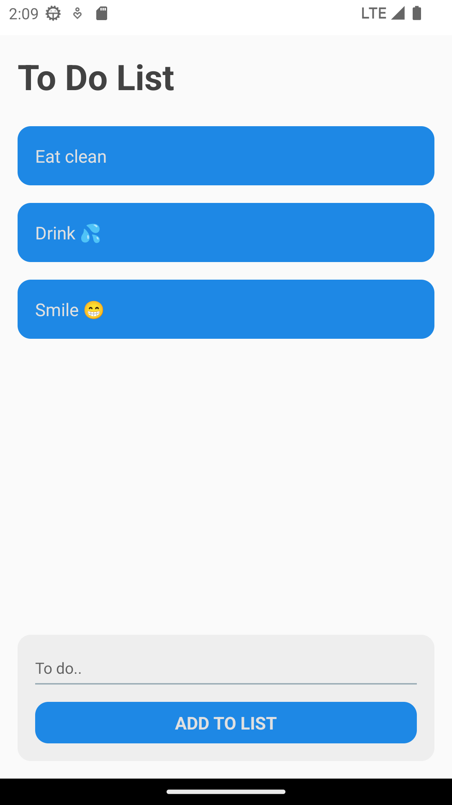

# TO DO List  with React Native

* This project is a simple To-Do List application built using React Native, the main purpose of which is to improve my skills and expertise in mobile application development. As a personal development project, it serves as a hands-on learning experience to deepen my understanding of React Native concepts, state management and UI design.

